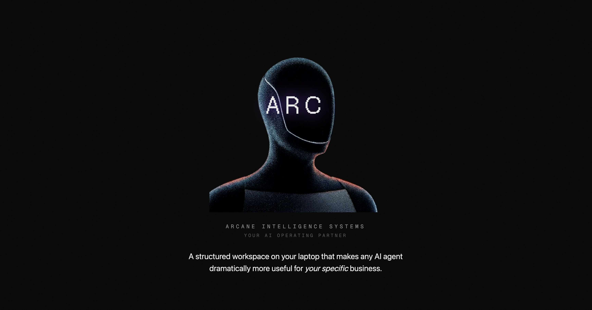

<p align="center">
  
</p>

# ARC

**By Arcane Intelligence — Built by Max Kelly**

A starter kit that gives founders an AI-powered operating partner for their business.

Clone it, run the setup, and you get a workspace that learns your business well enough to help with day-to-day work, strategic thinking, and workflow design.

This is not a generic chatbot prompt. It is a structured workspace designed to become more useful over time.

---

## What This Is

ARC is a structured workspace that turns an AI agent into a persistent operating partner for your business. Instead of re-explaining your business every time you open a chat, ARC stores your business context in structured files that the agent reads automatically.

After setup, your agent knows:
- what your business does and how it makes money
- who you are, what you're good at, and where you need help
- what tools and platforms you use
- what your current priorities and pain points are

It can then help you brainstorm what to automate, audit your tasks, explore new ideas, and execute faster than working alone.

ARC is designed for both technical and non-technical founders. On first use, the agent should ask what environment you're using and how technical you want it to be, then adapt from there.

### What founders usually get wrong about AI

Most founders use AI like a very smart intern in a blank chat:
- they repeat context every time
- they get generic answers
- they do not build any continuity
- they never turn good outputs into reusable workflows

ARC is meant to fix that. It gives the agent memory, structure, and a repeatable operating model.

### What this is for

ARC is for founders who want to:
- get more leverage from AI without becoming deeply technical
- capture business context once instead of re-explaining it every session
- identify what work should stay human, what should be AI-assisted, and what could become a workflow
- start simple now and layer on more sophistication later

### What this is not

ARC is not:
- a SaaS product
- a no-code automation platform
- a promise that AI will run your company for you
- a giant prebuilt system you need to understand before it becomes useful

It is a practical starting point for building an AI operating layer around your actual business.

### What you should expect from the workshop

In Session 1, the goal is not to install every integration or build advanced automations.

The goal is to leave with:
- your business context loaded into ARC
- one concrete first win completed
- a clearer sense of where AI can actually help in your business
- a workspace you can keep using after the workshop

---

## Getting Started

### Step 1 — Clone or download this repo

### Step 2 — Open it in your environment

**VS Code + Claude Code extension** (recommended):
1. Open the `arc-starter` folder in VS Code
2. Open the Claude Code panel
3. Start a conversation — the agent will read CLAUDE.md automatically

**Cursor + Claude Code extension**:
1. Open the `arc-starter` folder in Cursor
2. Open the Claude Code panel
3. Same as above — CLAUDE.md is read automatically

**Codex (VS Code extension)**:
1. Open the `arc-starter` folder in VS Code
2. Codex reads AGENTS.md for context (included alongside CLAUDE.md with identical content)
3. Start a conversation in natural language

**Claude Desktop**:
1. Create a new Project
2. Drag the files from `context/` and `CLAUDE.md` into the Project Knowledge
3. Start a conversation in natural language

**Terminal (Claude Code CLI)**:
1. `cd` into the `arc-starter` folder
2. Run `claude` to start a session
3. Claude Code reads CLAUDE.md automatically

### Step 3 — Start the conversation

Say **"help me get started"**, **"let's set up"**, or use `/setup` if your environment supports slash commands. The agent should first ask what environment you're using and how technical to be, then interview you about your business and populate the context files. There are two modes:

- **Quick setup** (~15 minutes) — captures the essentials, enough to be useful immediately
- **Deep setup** (~30 minutes) — comprehensive interview that fills in all the details

You can do the quick setup now and run the deep setup later when you have more time.

**Have existing documents?** Drop pitch decks, one-pagers, business plans, or any relevant docs into the `imports/` folder before starting setup. The agent will analyze them first and only ask about what's missing.

### Step 4 — Start using it

Once context is loaded, you can:

- Ask it for a quick win so it does one useful thing immediately
- Ask questions about your business and get answers grounded in your actual context
- Ask it to brainstorm what to automate or improve
- Ask it to audit your tasks
- Ask it to explore a specific idea and research/spec it out
- Just talk to it — ask for help with emails, reports, analysis, strategy, whatever you need

The important thing is not to use every command. It is to get one useful result quickly, then build from there.

---

## Commands

These are workflow shortcuts. In environments that support slash commands, you can type the `/command` name. Everywhere else, just say it naturally — the agent should understand both.

| Command | Or just say... | What it does |
|---------|---------------|--------------|
| `/setup` | "let's set up" | Interviews you and populates your business context files |
| `/first-win` | "get me a quick win" | Recommends the fastest useful thing ARC can do right now, then does it |
| `/brainstorm` | "what should I automate?" | Suggests automation and augmentation opportunities based on your context |
| `/audit` | "audit my tasks" | Structured task audit — inventory what you do and identify what to automate first |
| `/explore` | "explore this idea" | Takes an idea and researches the best way to build it |

If you're not sure where to start after setup, start with `/first-win`.

---

## Workspace Structure

```
arc-starter/
├── CLAUDE.md              # Agent instructions (Claude Code / Cursor)
├── AGENTS.md              # Same content (Codex / Hermes / other agents)
├── README.md              # You are here
├── context/               # Your business context (populated by /setup)
│   ├── workspace.md       # How you're using ARC: environment, comfort level, setup constraints
│   ├── setup-status.md    # Setup progress so ARC can resume without starting over
│   ├── overview.md        # One-page summary of the business and best next opportunities
│   ├── business.md        # Business model, market, customers, strategy
│   ├── founder.md         # Your background, role, preferences
│   ├── stack.md           # Tools, platforms, integrations
│   ├── priorities.md      # Current priorities and pain points
│   ├── memory.md          # Lightweight preferences learned over time
│   └── agent-learnings.md # Corrections — so mistakes aren't repeated
├── .claude/commands/      # Workflow prompts and slash commands in compatible environments
│   ├── setup.md
│   ├── first-win.md
│   ├── brainstorm.md
│   ├── audit.md
│   └── explore.md
├── imports/               # Drop documents here before running /setup
├── explorations/          # Output from /explore — plans accumulate here
└── guides/                # Reference material
    ├── what-is-this.md    # Plain-English explanation of the workspace
    ├── skills-explained.md # What skills are and how to create them
    ├── mcps-explained.md  # What MCPs are and when to add them
    ├── troubleshooting.md # What to do when the environment or setup is confusing
    └── next-steps.md      # Where to go after the basics
```

---

## Guides

New to this? Start with the guides in the `guides/` folder:

- **what-is-this.md** — Plain-English explanation of how this workspace works
- **skills-explained.md** — What skills are, how they work, and how to create your own
- **mcps-explained.md** — What MCP integrations are and when to add them
- **troubleshooting.md** — What to do if slash commands or context loading are confusing
- **next-steps.md** — Where to go after you've got the basics set up

---

## A Simple Way To Think About ARC

There are three stages:

1. **Load context**  
Teach ARC what your business is, what matters, and how you work.

2. **Get a first win**  
Use that context to do something useful immediately.

3. **Turn repeated work into workflows**  
When something works well, make it repeatable.

That is the whole model. Keep it that simple at the start.

---

## The ARC Progression

ARC is designed to grow with you in layers:

**Layer 1 — Context** (start here)
Set up your workspace and load your business context. This alone makes every AI conversation dramatically better.

**Layer 2 — Workflows**
Build specific workflows that automate or augment tasks in your business. Add tool integrations. Create custom commands for your recurring work.

**Layer 3 — Systems**
Scale from personal use to team infrastructure. Add guardrails, permissions, scheduling, and orchestration for more complex workflows.

Each layer builds on the previous one. You don't need to jump to Layer 3 on day one — start with context and let it grow.

---

*ARC by Arcane Intelligence. Proprietary — provided to workshop participants only.*
